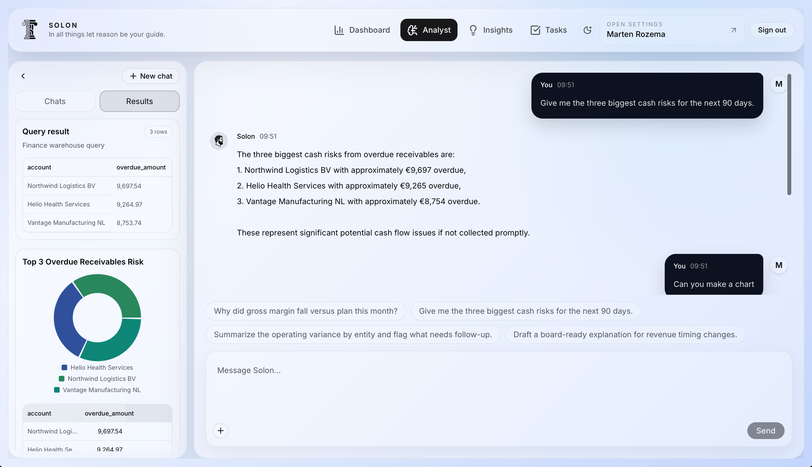
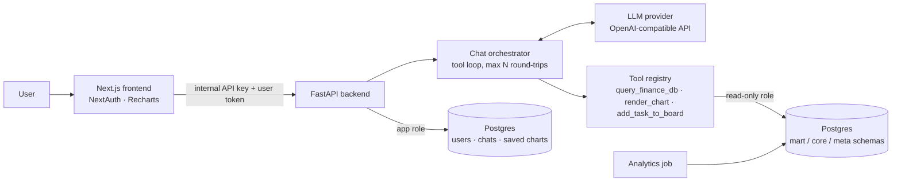

# Solon

[](https://github.com/martenroos/solon/actions/workflows/backend-tests.yml)

**An AI finance analyst for small and mid-sized companies.** Ask questions about your books in plain language. Solon writes the SQL, runs it against a finance data warehouse through a sandboxed read-only connection, and answers with numbers, charts and follow-up tasks.

> Personal side project, built in evenings and weekends to explore how LLM agents can safely work on structured enterprise data.

<!-- TODO: replace with a screenshot or short GIF of the analyst chat producing a chart -->


## What it does

- **Analyst chat**: a tool-calling agent that answers finance questions ("Which customers have the most overdue receivables?", "How did gross margin develop this quarter vs. budget?") by querying the warehouse directly.
- **Charts from chat**: the agent can render the result of a query as a chart. Charts can be saved to the dashboard, together with the SQL that produced them.
- **Tasks from chat**: the agent can turn findings into follow-up tasks on a kanban board, e.g. "chase the top 3 overdue accounts".
- **Insights and dashboard**: precomputed signals (revenue growth, margins, EBITDA, budget variance, AR/AP aging, cash forecast) with trends, segment breakdowns and the evidence behind each card.
- **Workspace basics**: Google and Microsoft Entra sign-in, user approval and admin roles, and saved conversation history.

## Architecture



**Request flow for a chat message**

1. The frontend sends the message, with the signed-in user's identity, to `POST /api/v1/chat/respond`.
2. The orchestrator loads the conversation, picks the agent definition (system prompt plus allowed tools) and calls the LLM.
3. When the model calls a tool, the orchestrator executes it, returns the result to the model and repeats, up to a configurable maximum number of round-trips.
4. Tools can emit *artifacts* (charts and tasks) alongside the text answer. The frontend renders these as interactive components.
5. Every message and tool call is persisted, so conversations can be resumed.

## Design decisions

**Letting an LLM write SQL safely.** The agent has real query access, so it has several layers of protection:

- **Separate database role.** Tool queries use their own connection (`LLM_DATABASE_URL`) with a dedicated Postgres role. That role can only read the analytical schemas (`mart`, selected `core` and `meta` tables), defaults to read-only transactions and has no access to users or chat history. See [`setup_llm_readonly_role.py`](backend/app/scripts/setup_llm_readonly_role.py).
- **Application-level validation.** Only a single `SELECT`/`WITH` statement is accepted. Write and DDL keywords, and references to system or app tables, are rejected before anything reaches the database.
- **Execution limits.** Each query runs in a `READ ONLY` transaction with a 5-second statement timeout. It is wrapped in a row limit (max 200 rows) and always rolled back.

The database permissions are the real security boundary. The validator gives the model a clear error message it can recover from, instead of a raw permission error.

**A warehouse built for the model, not just for dashboards.** The raw finance data (journal entries, invoices, open items, budgets) is modelled as dimensions and facts in `core`. Curated views in `mart` cover the common questions: P&L by period, budget vs. actual, and AR/AP aging. The system prompt includes a compact schema guide and tells the model to try `mart` views first. That keeps queries short and correct, and makes answers far more reliable than letting the model explore raw tables.

**Deterministic numbers, generative explanations.** KPI and insight signals are computed in Python ([`backend/app/domains/finance/`](backend/app/domains/finance/)), not by the LLM. The model is used for questions, explanations and exploration, while headline numbers stay reproducible.

**Provider-agnostic LLM layer.** The backend talks to models through a small `LLMProvider` protocol. The current implementation targets the OpenAI-style chat completions API (including Azure OpenAI), with a configurable base URL. Agents and tools are registries, so adding a specialist agent or a new tool is a configuration change, not a rewrite.

## Tech stack

| Layer | Tech |
| --- | --- |
| Frontend | Next.js 16 (App Router), React 19, TypeScript, Tailwind CSS 4, shadcn/ui, Recharts, NextAuth (Google, Microsoft Entra) |
| Backend | Python 3.11+, FastAPI, SQLAlchemy 2 (async), asyncpg, Pydantic Settings, Alembic |
| Data | PostgreSQL 16 with a star-schema finance warehouse (`core`), curated views (`mart`) and sync metadata (`meta`) |
| LLM | OpenAI-compatible chat completions with tool calling (OpenAI or Azure OpenAI) |

## Running locally

**Prerequisites:** Docker, Python 3.11+, Node 20+, an LLM API key, and Google or Microsoft OAuth credentials for sign-in.

```bash
# 1. Database
docker compose up -d postgres

# 2. Backend
cd backend
python -m venv .venv && source .venv/bin/activate
pip install -e .
cp .env.example .env          # fill in your LLM key and secrets
alembic upgrade head
python -m app.scripts.setup_llm_readonly_role --password change-me-readonly
python -m app.scripts.seed_finance_demo          # demo company "SOLON-DEMO"
python -m app.scripts.compute_finance_analytics  # precompute insight signals
uvicorn app.main:app --reload                    # http://localhost:8000

# 3. Frontend (new terminal)
cd frontend
npm install
cp .env.example .env.local    # OAuth credentials + backend secrets
npm run dev                   # http://localhost:3000
```

Add your email to `ADMIN_EMAILS` in `backend/.env` so your account is approved as an admin on first sign-in. See [`backend/README.md`](backend/README.md) for all LLM and database settings.

## Tests

```bash
cd backend
pip install -e ".[dev]"
pytest
```

The tests run without a database or API key:

- [`test_sql_guardrails.py`](backend/tests/test_sql_guardrails.py) checks that only single read-only queries get through, including data-modifying CTEs and `SELECT ... INTO`, and that app and system tables are off limits. It also checks that queries run in a read-only transaction with a timeout, a row cap and a rollback.
- [`test_chat_tool_loop.py`](backend/tests/test_chat_tool_loop.py) drives the orchestrator with a scripted fake LLM. It covers tool results being fed back to the model, artifacts being emitted, errors the model can recover from, tools the agent isn't allowed to use, and the round-trip limit.

## Project structure

```
backend/
  app/
    api/routes/        REST endpoints (auth, chat, finance, admin)
    llm/               provider abstraction and tool registry
    services/          chat orchestrator, agents, persistence
    domains/finance/   KPI calculations and insight signals
    scripts/           demo seeding, analytics job, read-only role setup
  alembic/versions/    schema migrations, including the finance warehouse
frontend/
  app/                 pages: analyst, dashboard, insights, tasks, settings
  components/          analyst chat, charts, insight cards, task board
  lib/backend/         typed client for the FastAPI backend
```

## Roadmap

- [ ] Mistral as a first-class provider, with model choice per agent
- [ ] Evaluation set of finance questions with expected results, to compare models and prompts
- [ ] One-command setup (`docker compose up` for the full stack with seeded data)
- [ ] Streaming responses
